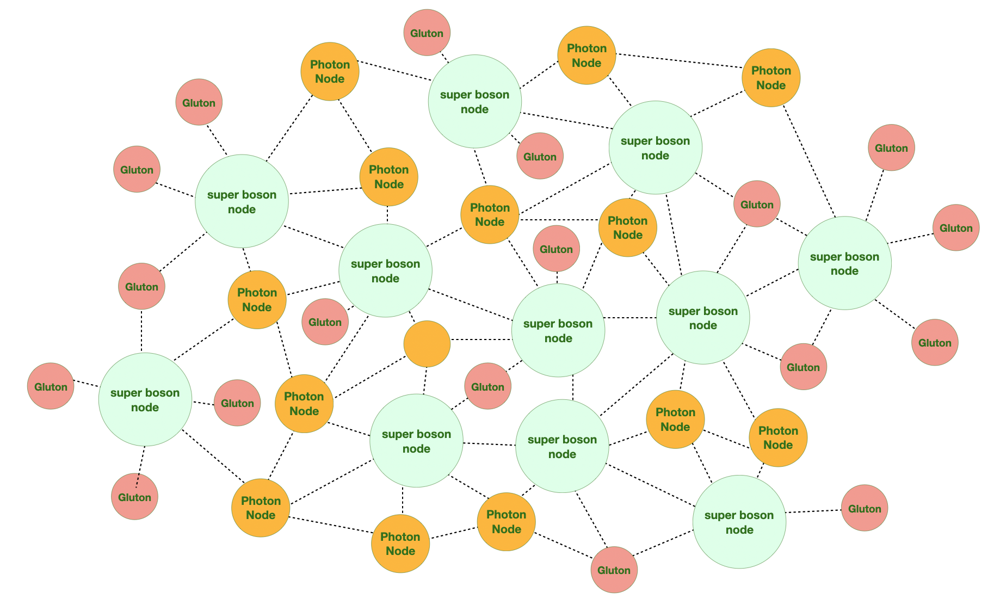

---
layout:
  title:
    visible: true
  description:
    visible: false
  tableOfContents:
    visible: true
  outline:
    visible: true
  pagination:
    visible: true
---

# Nodes

The Boson Network encompasses all nodes worldwide, categorized based on their deployment on public VPS, personal devices, Raspberry Pi devices, browsers, and other platforms. Together, these nodes form the integral components of the entire network.

* [**Super Node - Boson**](nodes.md#super-node-boson-node)
* [**Native Node - Photon**](nodes.md#native-node-photon-node)
* [**Lite Node - Gluton**](nodes.md#lite-node-gluton-node)

<figure><figcaption>
The Boson Network being composed of three types of nodes.
</figcaption></figure>

### Super Node - <mark style="color:green;">Boson</mark>

A boson super node, , also known as a boson node, is a bootstrap node dedicated to assisting new nodes seeking to join the network and broadcasting their presence. As public node services catering to applications, super nodes necessitate a server with public IP address. This is crucial to ensure that the public services they offer remain accessible, avoiding potential connectivity issues that may arise if the super node is running within a home WiFi network.

### Native Node - <mark style="color:green;">Photon</mark>

A native or regular node, also known as a photon node, typically is running alongside an application or is seamlessly integrated into an application on desktops or devices. Applications can leverage native nodes for various purposes, such as interacting with others to store or locate values, announcing or discovering peers, or directly streaming traffic. Native nodes commonly operate within a home WiFi network and initiate their network connection by bootstrapping from the super node during their initial connection. Once connected, these nodes autonomously organize themselves and propagate their presence throughout the network.

### Lite Node - <mark style="color:green;">Gluton</mark>

A lite node, also known as a gluton node, is crafted to operate as a browser application, leveraging the web gateway service provided by a designated super node. Unlike native nodes, lite nodes do not function independently but rather communicate with other nodes through the super node, facilitated by the web gateway service. Consequently, web applications running in the browser can be perceived as lite DHT nodes in terms of their interactions with other nodes.

## Propagation Nodes and Lookup Nodes

Since the boson network is a network of Kademia DHT, a basic protocol called <mark style="color:green;">**`find_node`**</mark> is used to distribute node information across interconnected nodes. This propagation occurs when nodes join the network and periodically thereafter. When a node receives information about neighboring nodes, it algorithmically merges these nodes into its routing table, improving the efficiency of data retrieval and network communication.

Each node within the network is assigned an unique node ID, a distinctive identifier that sets it apart. Applications can look or retrieve specific node details by using the node ID. This information includes the IPv4 or IPv6 addresses associated with the node, along with the node's version.

### Related Links

* [**Kademia DHT**](../kademlia-dht.md)
* The Protocol - find\_node
