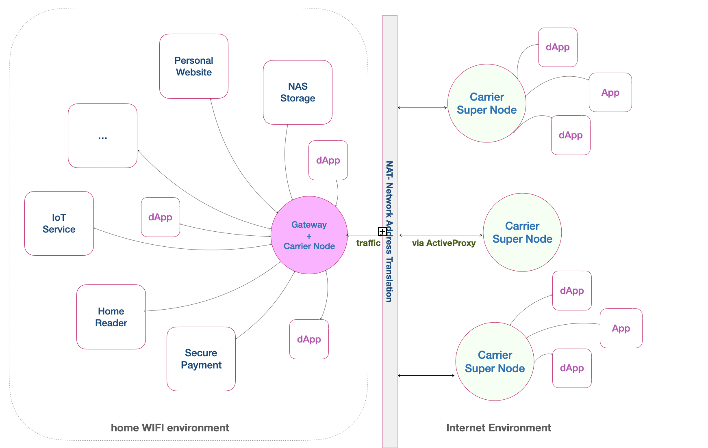

---
layout:
  title:
    visible: true
  description:
    visible: false
  tableOfContents:
    visible: true
  outline:
    visible: true
  pagination:
    visible: true
---

# Active Proxy

The <mark style="color:green;">**Active Proxy**</mark> service, provided by the boson super node, facilitates accessibility of a local or personal service running on your home WiFi to the public. Essentially, it forwards the entry to the personal service through the boson super node, rendering it visible to the public.

## Leverage for Home-Based Services

Suppose you wish to operate a blog service on a Raspberry device within your home WiFi network, sharing stories with the public. In such a scenario, you can employ the Active Proxy functionality from the super nodes you trust the most to publicize your blog service.

Similarly, consider a situation where you have set up a NAS or personal storage service on your home WiFi. While the service efficiently grants access to your data from within your home network, utilizing the Active Proxy allows you to announce the service access point from your home WiFi to the internet. This way, you can access your personal data remotely while still maintaining the privacy and security of your information.

<figure><figcaption>
An Imagined Gateway Service Leveraging on Active Proxy Feature
</figcaption></figure>

## Walk Through Active Proxy Service

A complete fulfillment of Active Proxy services consists of client and server components. Boson super nodes continue to provide the service by announcing these services over the network. On the other hand, a regular photon node hosts the client component, facilitating seamless interaction with one of the services.

To initiate a dedicated connection between a regular node hosting an active proxy client and a specified super node, a config file is used to specify the active proxy peer ID. Once the connection is established, it will be utilized to forward traffic between external dApps and the home-based service.

<figure><figcaption>
The work flow for Active Proxy between dApp and the home-based service.
</figcaption></figure>

## Related Links

* [Super Boson Node](../../operations/super-nodes.md#boson-super-nodes)
* [Regular Photon Node](../boson-protocol/nodes.md#native-node-photon-node)
