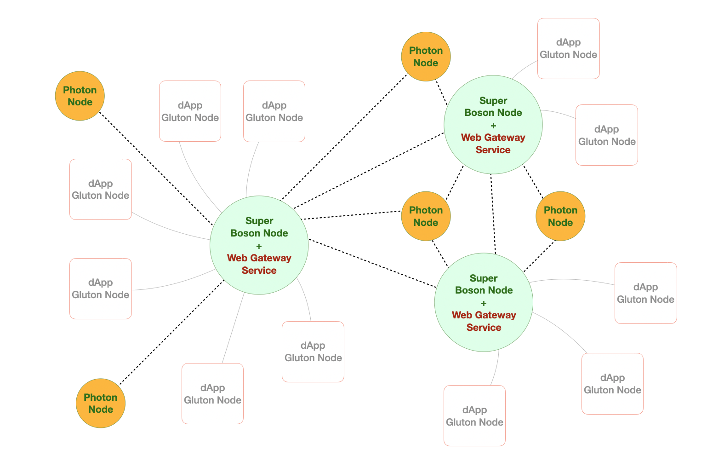

---
layout:
  title:
    visible: true
  description:
    visible: false
  tableOfContents:
    visible: true
  outline:
    visible: true
  pagination:
    visible: true
---

# Web Gateway

The <mark style="color:green;">**Web Gateway**</mark> service, offered by the super boson node, is a straightforward web service for the public. It enables lightweight applications, particularly those within browsers, to access certain features of the boson protocols without the need to be working as a full-fledged node. Instead, these applications utilize the super boson node as a gateway, facilitating seamless interaction with the boson network.

<figure><figcaption>
An imagined application scenario utilizing web gateway service
</figcaption></figure>

### Related Links

* [Boson Super Node](../boson-protocol/nodes.md#super-node-boson-node)
* [Boson Protocols](../boson-protocol/)
