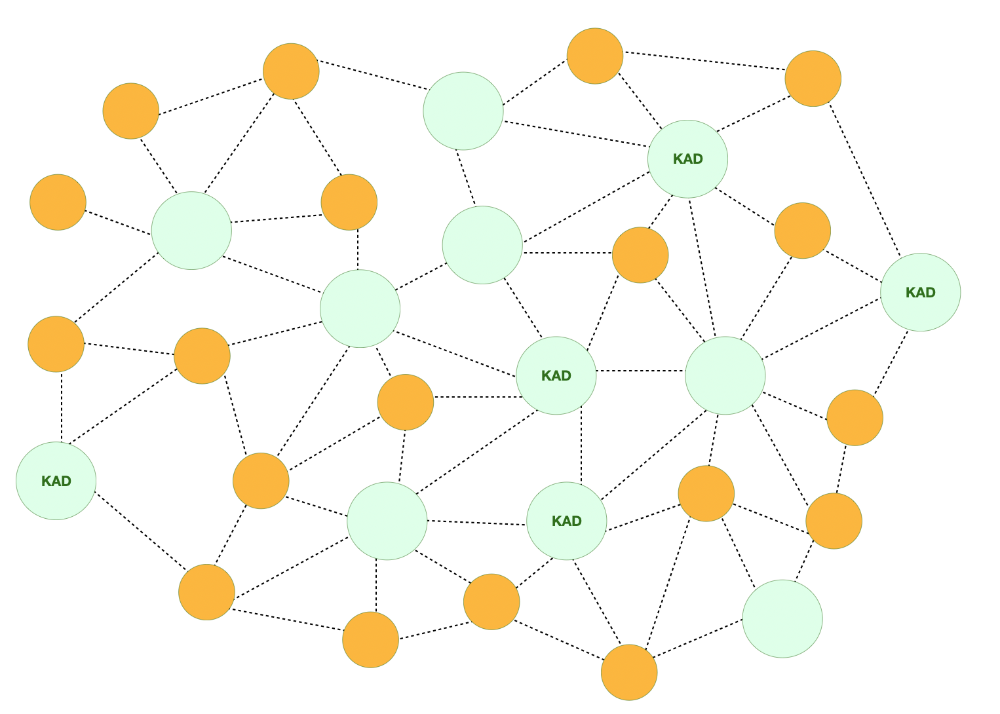

---
layout:
  title:
    visible: true
  description:
    visible: false
  tableOfContents:
    visible: true
  outline:
    visible: true
  pagination:
    visible: true
---

# Kademlia DHT

Kademlia DHT, created by Petar Maymounkov and David Mazières in 2002, is a distributed hash table specifically designed for decentralized peer-to-peer networks. It defines the network structure and outlines the process of exchanging information through node lookups. Communication between Kademlia nodes is facilitated using UDP. Each DHT node is uniquely identified by a node ID, a crucial element employed by the Kademlia algorithm to locate other nodes or values. For a more detailed exploration of Kademlia DHT, please refer to the dedicated [wiki](https://en.wikipedia.org/wiki/Kademlia) page.

<figure><figcaption>
A Kademia Distributed Hash Table Network
</figcaption></figure>

## The Strengths

The distributed nature of Kademlia mandates that each node upholds a mapping of a subset of nodes on the network within its routing table. This inherent feature imparts the network with heightened resistance to denial-of-service attacks and alleviates the consequences of node loss. The protocol dynamically reroutes around unavailable nodes, thereby enhancing the network's resilience. This fortification serves as a robust defense mechanism against potential attacks, downtimes, and central points of failure.

Leveraging these advantages, Kademlia DHT has garnered widespread adoption in prominent projects such as BitTorrent, Ethereum, IPFS, and Swarm. Acknowledging its effectiveness, Boson has strategically integrated Kademlia as the underlying DHT network, aligning with the overarching vision to position Boson as a fully decentralized and trustworthy communication platform.

## Related Links:

* [**Kademlia DHT**](https://en.wikipedia.org/wiki/Kademlia)
* [**BitTorrent**](https://en.wikipedia.org/wiki/BitTorrent)
* [**Ethereum**](https://en.wikipedia.org/wiki/Ethereum)
* [**IPFS**](https://en.wikipedia.org/wiki/InterPlanetary\_File\_System)
