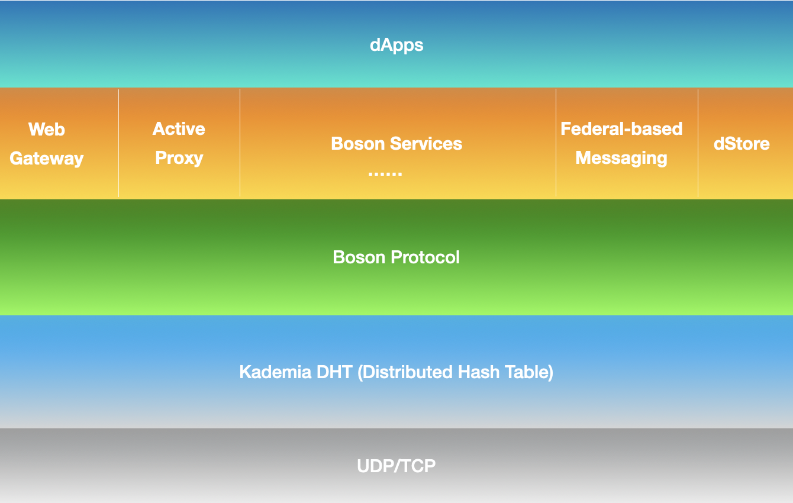

---
layout:
  title:
    visible: true
  description:
    visible: false
  tableOfContents:
    visible: true
  outline:
    visible: true
  pagination:
    visible: true
---

# The Overview

The updated boson retains its decentralized essence and preserves the peer-to-peer encrypted communication feature from its inception. Evolving with a strategic restructuring, it now operates as a layered and permissionless communication network. This transformation aims to broaden the spectrum of potential applications beyond the secure P2P communication feature. The layered structure, presented from the bottom up, is as follows:

* [**UDP/TCP**](https://en.wikipedia.org/wiki/Internet\_protocol\_suite)
* [**Kademlia DHT**](kademlia-dht.md)
* [**Boson Protocol**](boson-protocol/)
* [**Boson Service**](boson-services/)
* <mark style="color:green;">**dApps**</mark>

<figure><figcaption>
A layer-designed permissionless peer-to-peer encrypted network
</figcaption></figure>

In this layered structure, it is composed of core protocols UDP/TCP that facilitate the transmission of messages. The upper **Kademlia DHT** serves as a distributed hash table for decentralized peer-to-peer networking. This layer is intricately designed to facilitate information exchange among nodes. Moving up, the **Protocol** layer encompasses a suite of network protocols that enable communication between nodes. The topmost layer, **Boson Service**, encompasses a series of services designed to cater to applications. These services include the Web Gateway, Active Proxy, Messaging, and dStore.

Overall, the layered structure offers the network greater scalability and flexibility in terms of application adoption, and also enables more efficient communication between devices, since each layer serves a distinct purpose for applications.

### Related Links:

* [**Web Gateway**](boson-services/web-gateway.md)
* [**Active Proxy**](boson-services/active-proxy.md)
* [**Federal based Messaging**](boson-services/messaging-service.md)
* [**Decentralized Storage**](boson-services/dstore-service.md)
