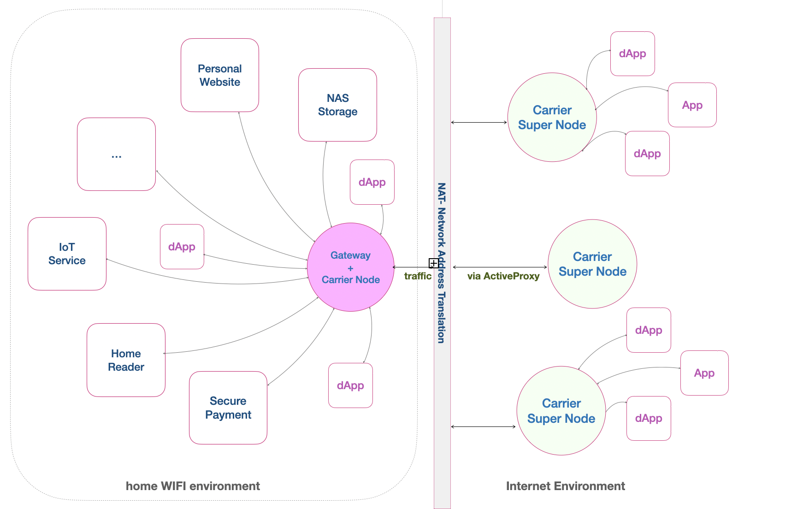

# pc2.net&#x20;

The [pc2.net](http://pc2.net/) is the website where users can register a dynamic domain name, known as a pc2 domain name. To access the website, users must sign in using Essentials wallet and Elastos DID, a decentralized identifier.

<figure><figcaption></figcaption></figure>

## Registering a pc2 Domain Name

Once the user is signed into [pc2.net](https://pc2.net/), click the `REGISTER DDNS NAME` button. This will display the page for registering a pc2 domain name. Be prepared with the following two items:

1. An available DDNS name, also known as a pc2 name.
2. The nodeId that you want to leverage for the Active Proxy service.

<figure><figcaption>
Register a pc2 domain name
</figcaption></figure>

## Checking pc2 Domain Names

Once succeed in registering the pc2 name, then the user can click `MY DDNS NAMES` button to check what are the pc2 names you have registered under the DID, and what node IDs are bound to those pc2 names respectively.

<figure><figcaption></figcaption></figure>


If you are running an Active Proxy client, either as a daemon or foreground command, to forward a local service entry and make it accessible to the public using a specific pc2 domain name, please ensure that the  nodeId matches the nodeId bound with the pc2 domain name. Otherwise, the Active Proxy client will not function properly.

